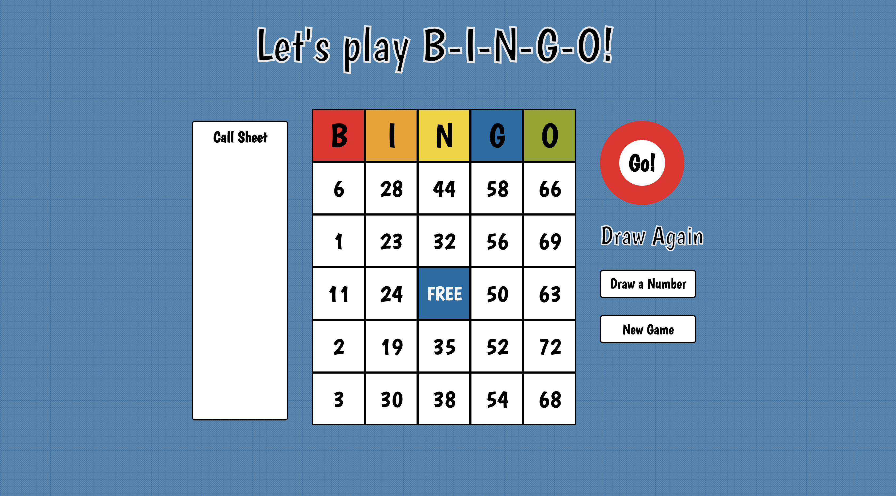

# **BINGO Game**
#### Created by Vittoria Erdem

### **How To Play:**
* Click Draw a Number to randomly drawn a Bingo Ball. Click on the BINGO board square to mark the board. Win by getting 5 in a row, column or diagonally. [Play now!](https://vittoriaerdem.github.io/bingo-game/)

### **Objective:**
* Create an interactive bingo game that allows the player to click on the square once the number is called. After thre player gets 5 boxes in a row they can call B-I-N-G-O!

### **Technology used:**
* HTML, CSS & JavaScript

### **Wireframes:**

### **User Stories:**
* As a user (AAU) I want an interactive bingo experience
* AAU I want the drawn number to randomly be selected
* AAU I want the numbers to be randomly assigned in the board
* AAU I want the numbers to be organized by columns, B: 1-15, I: 16-30, N: 31-45, G: 46-60, O: 61-75

### **Features List:**
* Each column of B-I-N-G-O has randomly assigned numbers
* Clicking "Next Number" shows a randomly selected number from 1-75
* Clicking on a bingo square changes the color.

### **Stretch Goals:**
* Animation - Bingo ball will rotate when new number is drawn
* Automation - Draw a new number after a few seconds
* Color Coordination - The bingo ball will have the appropriate color of the column the number belongs to (i.e. Ball #4 will be red, Ball #51 will be blue)
* Disabling Game - Disable clicking on squares after game is won
* Duplicate Removal - Prevent duplicate numbers from being drawn

### **Psuedocode:**

* Create a grid of 30 squares
* Show the bingoNumber inside a "Bingo Ball" looking div
* Create a draw-a-number button
* Create a new-game button
* Click on draw-a-number button & generate a new bingoNumber & appear on the Call Sheet
* Click on new-game button & refresh pages & regenerates new numbers the board
* Clicking on a square changes the background color but number is still visible
* After clicking on 5 squares in a row, column or diagonally, the player gets a win message